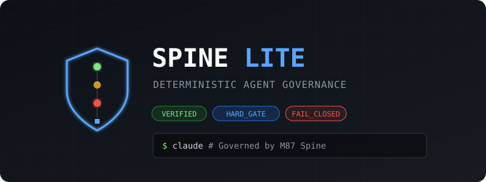

<p align="center">
  
</p>

# Spine Lite

**Governance guardrails for Claude Code.** Deterministic guards, cryptographic receipt chains, and runtime-enforced policy -- so you can prove what your AI coding agent did, what it was denied, and verify the record wasn't tampered with.

> **Repository role:** Original Claude Code governance hook implementation. Defines its own 7-class effect taxonomy (`SAFE_READ`/`SHELL_SAFE`/`SHELL_MUTATING`/`SCOPED_WRITE`/`RESTRICTED_WRITE`/`SHELL_DANGEROUS`/`NETWORK_ATTEMPT`), which is a separate lineage from the 6-class taxonomy in [spine-lite-python](https://github.com/MacFall7/spine-lite-python) (`READ`/`WRITE`/`NETWORK`/`EXECUTE`/`SPAWN`/`DESTRUCTIVE`). [spine-lite.NET](https://github.com/MacFall7/spine-lite.NET) is wire-compatible with this repo's taxonomy, not spine-lite-python's — do not assume cross-runtime interop between the two lineages without checking.
> **Status:** Active, in production use as the Claude Code hook governance layer.

---

## What is Spine Lite?

Spine Lite is a governance layer that sits between Claude Code and your codebase. When Claude Code tries to execute any tool -- run a command, write a file, edit a file -- Spine Lite intercepts it, classifies it, and decides whether to allow or block it **before the tool runs**.

Every time Claude Code attempts an action, the hook fires and:

1. **Classifies the action** into one of 6 effect classes (safe read, mutation, network attempt, dangerous command, scoped write, restricted write)
2. **Denies or allows** based on your policy -- denial uses exit code 2, which is a hard gate at the Claude Code runtime level. The tool physically cannot execute.
3. **Emits a cryptographic receipt** for every decision -- hash-chained, so tampering with the audit trail breaks the chain
4. **Tracks session risk** -- blocked actions accumulate risk. Hit thresholds and the posture escalates (NORMAL -> ELEVATED -> LOCKDOWN -> HARD_TERMINATE)
5. **Enforces autonomy budgets** -- max steps, max writes, max commands per session
6. **Runs a quality gate** on session close -- tests must pass, receipts must verify

### What that means in practice

You open Claude Code in a project with Spine Lite installed. Claude can `git status`, read files, run tests. It **cannot** `curl` anything, `rm -rf` anything, install packages, touch `.env` files, or push code without the guard allowing it. Every action it takes is logged with a verifiable receipt. If it tries too many disallowed things, the session locks down.

### What you ship to others

A portable governance pack. Anyone drops it into a Claude Code project, runs the bootstrap, and their Claude Code sessions are governed. No dependencies beyond Python 3.10+. Three policy templates (strict, standard, minimal) for different risk tolerances.

---

## Quick start

```bash
# Clone into your project
git clone https://github.com/MacFall7/M87-Spine-lite.git .spine
cp -r .spine/{.claude,CLAUDE.md,governance,hooks,schemas,scripts,policy_templates,docs} .

# Bootstrap (validates Python, dependencies, policy, runs smoke tests)
chmod +x scripts/bootstrap.sh
./scripts/bootstrap.sh

# Launch Claude Code -- governance hooks fire automatically
claude
```

That's it. `.claude/settings.json` registers the hooks. Every Bash, Write, and Edit tool call now passes through the governance guard.

**Windows:**

```powershell
.\scripts\bootstrap_windows.ps1
```

---

## See it in action

```bash
python scripts/demo.py
```

Runs a 10-step demo: initializes a governed session, executes allowed commands, attempts blocked commands (`curl`, `rm -rf`, `pip install`, `.env` write), verifies the receipt chain, and closes with an audit summary.

---

## How it works

### The enforcement pipeline

Claude Code's native hook system calls `hooks/entry.py` at four lifecycle points:

```
SessionStart  ->  entry.py  ->  governor.py init-session
                                  |
                             Creates session state, receipt directory, zeroed budget

PreToolUse    ->  entry.py  ->  governor.py check-command / check-write
                                  |
                             guard.py classifies action -> ALLOW or DENY
                                  |
                             If DENY -> entry.py exits with code 2 (stderr -> Claude)
                             Claude Code runtime blocks the tool call

PostToolUse   ->  entry.py  ->  governor.py receipt
                                  |
                             receipts.py emits hash-chained receipt JSON

SessionEnd    ->  entry.py  ->  governor.py close-session
                                  |
                             Verifies receipt chain integrity, writes audit summary
```

| Event | What happens |
|-------|-------------|
| **SessionStart** | Initializes session state, receipt directory, zeroed budget |
| **PreToolUse** | Guard classifies the action -> ALLOW or DENY. DENY exits with code 2, which hard-blocks the tool call at the runtime level. |
| **PostToolUse** | Emits a hash-chained receipt for the completed action |
| **SessionEnd** | Verifies receipt chain integrity, writes audit summary |

### Why exit code 2?

Claude Code supports a hard-gate enforcement mechanism: if a `PreToolUse` hook exits with code 2, the tool call is **blocked at the runtime level**. The model cannot bypass it. This is not JSON-advisory denial (which has known reliability issues -- see Claude Code GitHub issues #4669, #21988). Exit code 2 is the kernel boundary -- the Claude Code runtime will not execute a tool past it, regardless of model behavior.

### Classification pipeline

Every command passes through a 5-step classification chain:

1. **Deny check** -- Is this command in the explicit deny list? (`rm -rf`, `sudo`, `chmod 777`, `dd`, `mkfs`, force push, etc.)
2. **Network check** -- Does this command attempt network egress? (`curl`, `wget`, `ssh`, `pip install`, `npm install`, `git push`, etc.)
3. **Safe check** -- Is this a known read-only command? (`git status`, `ls`, `cat`, `pytest`, `ruff check`, etc.)
4. **Mutating check** -- Is this a known state-changing command? (`git add`, `mkdir`, `cp`, `mv`, etc.)
5. **Fail-closed** -- Unknown command -> classified as `SHELL_DANGEROUS` -> DENY

File writes pass through scope validation:

- **Writable paths** -- Configured in policy (`src/`, `tests/`, `docs/`, etc.)
- **Denied paths** -- Secrets and credentials (`.env*`, `*.key`, `*.pem`, `credentials*`)
- **Restricted paths** -- Governance files (`policy.yaml`, `*.schema.json`) -- require operator override
- **Path traversal protection** -- Paths are resolved and validated against the workspace root; `../` attacks are blocked

### The 6 effect classes

| Effect class | Risk delta | Auto-approve | Description |
|---|---|---|---|
| `SAFE_READ` | 0.00 | Yes | Read-only operations |
| `SHELL_SAFE` | 0.01 | Yes | Known non-mutating commands (`git status`, `ls`, `pytest`) |
| `SHELL_MUTATING` | 0.04 | Yes | Known state-changing commands (`git add`, `mkdir`, `cp`) |
| `SCOPED_WRITE` | 0.02 | Yes | File writes within allowed scope |
| `RESTRICTED_WRITE` | 0.08 | No | Governance files, schemas -- requires operator override |
| `SHELL_DANGEROUS` | 0.10 | No | Destructive commands, unknown commands (fail-closed) |
| `NETWORK_ATTEMPT` | 0.15 | No | Any command that attempts network egress |

### Risk model and posture escalation

Each denied action adds a risk delta to the session's cumulative score. Risk thresholds trigger posture escalation:

| Posture | Threshold | Effect |
|---------|-----------|--------|
| **NORMAL** | 0.00 | Standard operation -- safe + mutating commands allowed |
| **ELEVATED** | 0.30 | Only safe commands and scoped writes allowed |
| **LOCKDOWN** | 0.50 | Only safe read commands allowed, all writes denied |
| **HARD_TERMINATE** | 1.00 | Session terminated |

Posture escalation is automatic and irreversible within a session. If Claude Code keeps attempting blocked actions, the session progressively tightens until it locks.

### Receipt chain

Every action -- allowed or blocked -- produces a cryptographic receipt containing:

- **Identity**: `receipt_id` (UUID), `session_id`, `sequence_number`, `timestamp`
- **Executor**: model type, instance ID
- **Action record**: tool, operation, effect_class, risk_delta, command/path, reversibility
- **Result record**: status (success/blocked/failed), exit_code, blocked_by, diff_hash
- **Budget snapshot**: steps used/remaining, commands, writes, risk score, current posture
- **Git context**: branch, commit hash before/after
- **Chain links**: SHA-256 hash of this receipt, hash of previous receipt

Each receipt's hash is computed from its content (excluding the hash fields themselves). The `previous_receipt_hash` field links it to the prior receipt, forming a hash-linked ledger. On session close, the entire chain is verified: if any receipt has been modified, the hash chain breaks and session closure fails.

Receipts are persisted to `governance/receipts/{session_id}/` as individual JSON files, validated against `schemas/receipt.schema.json`. An optional Redis backend provides cross-session persistence and multi-agent coordination.

### Autonomy budget

Per-session resource limits prevent runaway agent behavior:

| Limit | Default | Description |
|-------|---------|-------------|
| `max_steps` | 20 | Total discrete operations |
| `max_commands` | 15 | Shell/tool invocations |
| `max_write_operations` | 10 | File create/modify/delete |
| `max_files_touched` | 20 | Unique file paths |
| `max_runtime_seconds` | 300 | Wall-clock per session segment (5 min) |
| `max_external_calls` | 0 | Network calls (disabled by default) |

When any limit is hit, the action is denied. With `breach_behavior: hard_halt` (default), the session stops.

---

## What gets blocked (strict policy)

| Action | Effect class | Verdict |
|--------|-------------|---------|
| `git status` | SHELL_SAFE | ALLOW |
| `pytest` | SHELL_SAFE | ALLOW |
| `ls -la` | SHELL_SAFE | ALLOW |
| `cat README.md` | SHELL_SAFE | ALLOW |
| `ruff check .` | SHELL_SAFE | ALLOW |
| `git add .` | SHELL_MUTATING | ALLOW |
| `mkdir src` | SHELL_MUTATING | ALLOW |
| `cp file.txt backup.txt` | SHELL_MUTATING | ALLOW |
| Write to `src/main.py` | SCOPED_WRITE | ALLOW |
| Write to `tests/test_foo.py` | SCOPED_WRITE | ALLOW |
| Write to `docs/guide.md` | SCOPED_WRITE | ALLOW |
| `curl https://...` | NETWORK_ATTEMPT | **DENY** |
| `wget http://...` | NETWORK_ATTEMPT | **DENY** |
| `pip install requests` | NETWORK_ATTEMPT | **DENY** |
| `npm install express` | NETWORK_ATTEMPT | **DENY** |
| `git push` | NETWORK_ATTEMPT | **DENY** |
| `git pull` | NETWORK_ATTEMPT | **DENY** |
| `ssh user@host` | NETWORK_ATTEMPT | **DENY** |
| `rm -rf /` | SHELL_DANGEROUS | **DENY** |
| `sudo anything` | SHELL_DANGEROUS | **DENY** |
| `chmod 777 .` | SHELL_DANGEROUS | **DENY** |
| `dd if=/dev/zero` | SHELL_DANGEROUS | **DENY** |
| `mkfs.ext4 /dev/sda` | SHELL_DANGEROUS | **DENY** |
| `git push --force origin` | SHELL_DANGEROUS | **DENY** |
| `unknown_binary --flag` | SHELL_DANGEROUS | **DENY** |
| Write to `.env` | RESTRICTED_WRITE | **DENY** |
| Write to `secrets.key` | RESTRICTED_WRITE | **DENY** |
| Write to `credentials.json` | RESTRICTED_WRITE | **DENY** |
| Write to `cert.pem` | RESTRICTED_WRITE | **DENY** |

---

## Policy templates

| Template | Network | Write scope | Blocking | Use case |
|----------|---------|-------------|----------|----------|
| **strict.yaml** | Blocked | Tight (src, tests, docs, governance, hooks, schemas, scripts, config) | Full enforcement | Security-sensitive repos, compliance. **Default.** |
| **standard.yaml** | Package managers only (pip, npm, yarn) | Broader (+ node_modules, lock files) | Full enforcement | Most day-to-day development work |
| **minimal.yaml** | All allowed | All paths writable | Audit-only (no blocking, receipts still emitted) | Visibility without restriction |

```bash
# Switch to standard policy
cp policy_templates/standard.yaml governance/policy.yaml
./scripts/bootstrap.sh
```

See [POLICY_GUIDE.md](POLICY_GUIDE.md) for full customization options including risk tuning, custom command lists, and quality gate configuration.

---

## Quality gates

Quality gates run at two checkpoints, enforced by `governor.py quality-gate`:

| Gate | Tests must pass | Lint must pass | Receipt chain valid |
|------|:-:|:-:|:-:|
| **pre-modify** | Yes | Yes | -- |
| **pre-commit** | Yes | Yes | Yes |

- **Test runner**: `pytest` by default, configurable via `quality_gates.test_runner.command` in policy
- **Linter**: `ruff check .` by default, configurable via `quality_gates.linter.command` in policy
- **Timeouts**: 120s for tests, 30s for linter (configurable)
- **Graceful degradation**: If the test runner or linter is not installed (exit code 127) or no tests are collected (pytest exit code 5), the gate warns and passes rather than failing

---

## Project structure

```
.
├── .claude/settings.json        <- Registers hooks with Claude Code runtime
├── CLAUDE.md                    <- Fallback governance instructions (in-context)
├── governance/
│   ├── policy.yaml              <- Active policy (edit this)
│   ├── receipts/{session_id}/   <- Hash-chained receipt files per session
│   └── sessions/                <- Session state (active_session.json)
├── hooks/
│   ├── entry.py                 <- Hook dispatcher (called by Claude Code)
│   ├── governor.py              <- CLI wiring (session lifecycle, budget, posture)
│   ├── guard.py                 <- Classification engine + deny/allow logic
│   └── receipts.py              <- Receipt emission + chain verification
├── schemas/
│   └── receipt.schema.json      <- JSON Schema for receipt validation
├── scripts/
│   ├── bootstrap.sh             <- Linux/macOS setup + smoke tests
│   ├── bootstrap_windows.ps1    <- Windows setup + smoke tests
│   └── demo.py                  <- End-to-end 10-step demo
├── policy_templates/
│   ├── strict.yaml              <- No network, tight scope (default)
│   ├── standard.yaml            <- Package managers allowed
│   └── minimal.yaml             <- Audit-only, no blocking
├── tests/
│   └── test_smoke.py            <- Classification + scope + policy tests
├── docs/
│   ├── ARCHITECTURE.md          <- Enforcement pipeline deep dive
│   ├── ONBOARDING.md            <- Step-by-step setup and integration guide
│   └── POLICY_GUIDE.md          <- Policy customization reference
├── CHANGELOG.md
└── LICENSE                      <- MIT
```

### Key files explained

| File | Role |
|------|------|
| `.claude/settings.json` | Tells Claude Code to call `hooks/entry.py` on SessionStart, PreToolUse, PostToolUse, and SessionEnd events. This is the integration point. |
| `hooks/entry.py` | Receives hook events from Claude Code as JSON on stdin. Routes to governor.py. For PreToolUse, exits with code 2 to block denied actions. |
| `hooks/guard.py` | Pure classification engine. Regex-based command matching, glob-based path matching. No network, no LLM calls, no side effects. Deterministic. |
| `hooks/receipts.py` | Builds receipt JSON, computes SHA-256 hashes, links to previous receipt, validates against schema, writes to filesystem. |
| `hooks/governor.py` | CLI that wires guard + receipts together. Manages session state, budget tracking, posture updates, quality gates. |
| `governance/policy.yaml` | The single source of truth for all governance rules. 10 sections covering invariants, budgets, containment, scope, hooks, classification, risk, receipts, quality gates, and multi-agent coordination. |

---

## Manual usage (without Claude Code hooks)

The governance layer works as a standalone CLI for testing, CI pipelines, or integration with other agent frameworks:

```bash
# Initialize a governed session
python hooks/governor.py init-session
# -> prints session_id (12-char hex)

# Check if a file write is allowed
python hooks/governor.py check-write --path src/main.py
# -> JSON: {"verdict": "ALLOW", "effect_class": "SCOPED_WRITE", ...}

# Check if a command is allowed
python hooks/governor.py check-command --command "git status"
# -> JSON: {"verdict": "ALLOW", "effect_class": "SHELL_SAFE", ...}

# Emit a receipt for a completed action
python hooks/governor.py receipt --action command --command "git status" \
  --exit-code 0 --proposal-id "step-1" --description "Check repo status"

# Check session status (posture, risk, budget)
python hooks/governor.py status
# -> JSON with full session state

# Run a quality gate
python hooks/governor.py quality-gate pre-modify
python hooks/governor.py quality-gate pre-commit

# Close session (verifies receipt chain + quality gates)
python hooks/governor.py close-session
```

### Exit codes

| Exit code | Meaning |
|-----------|---------|
| 0 | Success / action allowed |
| 2 | Hard denial (used by entry.py for PreToolUse blocking) |
| 3 | Guard denial (check-command, check-write, receipt for blocked action) |
| 4 | Quality gate failure |
| 5 | Chain verification failure (receipt tampered or missing) |
| 6 | Session close failure (quality gates not satisfied) |

---

## Requirements

- **Python 3.10+** (3.10, 3.11, 3.12 tested in CI)
- **pyyaml** (installed automatically by bootstrap)
- Optional: **jsonschema** (strict receipt validation against JSON Schema; falls back to structural check if absent)
- Optional: **redis** (multi-session persistence and cross-agent coordination; filesystem is always primary)

No other runtime dependencies. No compiled extensions. No network access required for operation.

---

## Design principles

| Principle | What it means |
|-----------|---------------|
| **Incapacity over trust** | The guard *cannot* be bypassed, not "should not" be bypassed. Exit code 2 is a runtime hard gate. |
| **Fail-closed** | Unknown inputs, missing data, hook errors -> deny. No silent degradation. No fallback to permissive mode. |
| **Most-restrictive wins** | Ambiguous classifications get the stricter class. Unknown commands are SHELL_DANGEROUS. |
| **Artifact-backed audit** | No action is invisible. Every tool call produces a receipt. Session close requires chain verification. |
| **Model-independent** | Guards are pure Python. No prompt engineering, no model-specific logic. Works with any model. |
| **Deterministic** | Same input -> same classification -> same verdict. No randomness, no heuristics, no LLM in the enforcement path. |
| **Zero dependencies** | Core runs on Python 3.10+ stdlib + pyyaml. No build step, no compilation, no container required. |

---

## 7 architectural invariants

The governance policy codifies 7 architectural invariants that hold across all sessions:

1. **Proposal != Execution** -- Claude Code is a proposal generator and bounded executor, never the authority. All mutations require governance gate approval.
2. **Authority separation** -- Claude Code cannot approve its own proposals. Decision logic (guard) and execution logic (Claude Code session) are logically separated.
3. **Fail-closed default** -- On ambiguity, missing constraint, hook failure, or budget breach: halt. No silent degradation. No fallback to permissive mode.
4. **Artifact-backed completion** -- No task is "complete" without: diff hash, receipt JSON, test pass status. Conversational confirmation is not completion.
5. **Structured memory** -- Session state is artifact-based. Restore = replay + diff, not conversational recall. Session continuity requires session_id + git commit + receipt chain.
6. **Model interchangeability** -- Policy and hooks function regardless of underlying model. No Claude-specific prompt tricks in enforcement logic.
7. **Narrative != Runtime** -- Investor/demo framing cannot relax policy. Enforcement mode changes require manual operator override with audit log entry.

---

## CI

GitHub Actions workflow (`.github/workflows/ci.yaml`) runs on every push and PR to `main`, across Python 3.10--3.12:

1. **Compile check** -- All Python source files compile without syntax errors
2. **Policy validation** -- Policy YAML loads, enforcement mode is `strict`, 7+ invariants present, hash verified
3. **Classification matrix** -- 11 commands tested against expected effect classes (curl, pip, rm -rf, sudo, git status, pytest, git add, mkdir, unknown binary)
4. **End-to-end demo** -- Full 10-step governance pipeline: init, allow, deny, receipt chain, risk verification, quality gate, session close
5. **Reference sweep** -- Ensures no internal references leak into source files

---

## Environment variables

| Variable | Default | Description |
|----------|---------|-------------|
| `SPINE_POLICY_PATH` | `governance/policy.yaml` | Path to active policy file |
| `SPINE_RECEIPT_DIR` | `governance/receipts` | Root directory for receipt storage |
| `SPINE_RECEIPT_SCHEMA` | `schemas/receipt.schema.json` | Path to receipt JSON Schema |
| `SPINE_SCHEMA_VALIDATION` | `strict` | Receipt validation mode: `strict`, `warn`, or `off` |
| `SPINE_REDIS_ENABLED` | `false` | Enable Redis as secondary receipt store |
| `SPINE_REDIS_URL` | `redis://localhost:6379/0` | Redis connection URL |
| `SPINE_MODEL` | `unknown` | Executor model name (recorded in receipts) |
| `SPINE_INSTANCE` | (auto-generated) | Executor instance ID |

Bootstrap writes these to `config/.env.spine` for reference.

---

## .gitignore recommendations

Session artifacts are ephemeral and should not be committed:

```
governance/receipts/
governance/sessions/
config/.env.spine
```

---

## Troubleshooting

### "Hook input was not valid JSON"

The hook received malformed input from Claude Code. This triggers fail-closed denial. Ensure `.claude/settings.json` is correctly formatted and the hook command path is valid.

### Commands I expect to be safe are blocked

Unknown commands are classified as `SHELL_DANGEROUS` (fail-closed). Add the command prefix to `SAFE_COMMAND_PREFIXES` in `hooks/guard.py` or to `safe_command_prefixes` in the policy YAML.

### Session won't close

Session close requires: (1) receipt chain integrity verified, (2) quality gates passed (tests + lint). Run `python hooks/governor.py quality-gate pre-commit` first to see which gate is failing.

### "No active session"

Run `python hooks/governor.py init-session` before other commands. When using Claude Code hooks, this happens automatically at SessionStart.

### Bootstrap fails on pyyaml

If `pip install pyyaml` fails, install it manually: `python3 -m pip install pyyaml --user` or use your system package manager.

### Posture stuck in LOCKDOWN/HARD_TERMINATE

Posture escalation is irreversible within a session. Start a new session with `init-session` to reset.

---

## License

MIT -- Copyright (c) 2026 M87 Studio LLC
